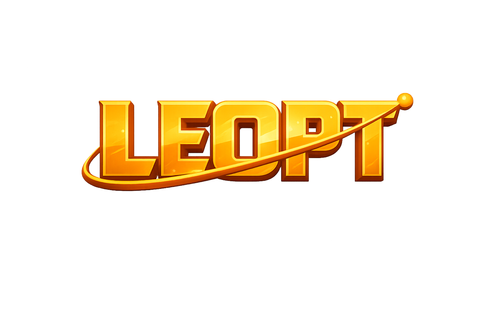

<p align="center">
  
</p>

# LEOPT

Bayesian search and antenna pointing for satellite acquisition. LEOPT propagates
an uncertain orbit, plans where to point a ground antenna, and updates the search
after detections and misses.

The Python library includes finite-horizon beam search, continuation rollout,
POMCP, PFT-DPW, and baseline scan policies. The web application provides orbit
ingest, station selection, belief visualization, and schedule exports.

## Install

Python 3.11 or newer is required.

```bash
git clone https://github.com/satellite-acquisition/leopt.git
cd leopt
python -m venv .venv
source .venv/bin/activate
python -m pip install -e '.[platform]'
```

Use `pip install -e .` for the core library. Optional extras are `viz` for plots,
`validation` for the Brahe geometry cross-check, and `adapters` for serial and
SNMP interfaces.

## Use

Run a small synthetic search:

```bash
python examples/search.py
```

Start the console:

```bash
uvicorn acquisition_platform.service.app:app --host 127.0.0.1 --port 8000
```

Open <http://127.0.0.1:8000>. The API reference is at `/docs`. Set
`LEOPT_STATE_DB=/path/to/leopt.db` to retain sessions between runs. Use one server
worker because active sessions are held in process memory.

The console is a research prototype with demo and API-backed planning modes.
Schedules are advisory; the web service does not command hardware. Web plans
are capped at 20 dwells per pass, with incomplete tails identified in exports.
The browser loads libraries and fonts from public CDNs and needs an internet
connection.

## Source

| Path | Contents |
| --- | --- |
| `src/antenna_pomdp/control/` | Array-based Bayesian search, continuation rollout, and mount constraints |
| `src/antenna_pomdp/pomdp/` | Antenna search environment, POMCP, and PFT-DPW |
| `src/antenna_pomdp/baselines/` | Raster, line, information-greedy, and Koopman policies |
| `src/antenna_pomdp/orbit/` | SGP4 propagation, uncertainty sampling, and station geometry |
| `src/antenna_pomdp/models/` | Particle beliefs and detection models |
| `src/antenna_pomdp/eval/` | Episode evaluation and schedule execution |
| `src/acquisition_platform/` | FastAPI service, console, orbit ingest, and equipment interfaces |

The solvers in `control/` accept particle weights, detection probabilities, and
feasibility constraints as arrays, so they can be used without the web application
or an orbital propagator. Existing Python import names are retained.

## Development

With [uv](https://docs.astral.sh/uv/) installed:

```bash
uv sync --frozen --extra platform --extra viz --extra validation
uv run pytest -q
uv run ruff check .
```

## License

[MIT](LICENSE). Third-party dependencies retain their own licenses.
